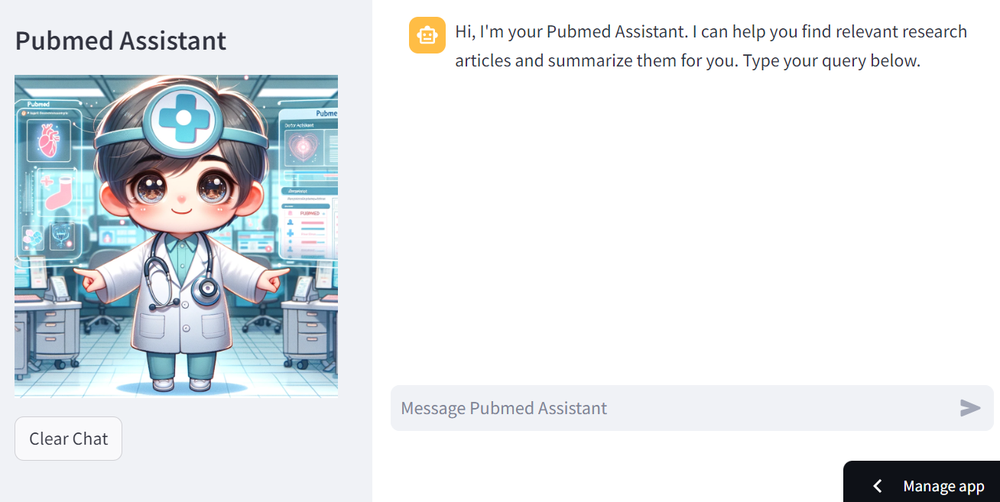

# Pubmed Assistant



This is a Streamlit application that serves as a Pubmed Assistant. It helps users find relevant research articles from [PubMed](https://pubmed.ncbi.nlm.nih.gov/) and provides summaries of those articles.

## Installation

1. Clone the repository:

    ```bash
    git clone https://github.com/chienhung1519/pubmed-assistant.git
    ```

2. Install the required dependencies:

    ```bash
    pip install -r requirements.txt
    ```

3. Set up the necessary API keys:

    - Obtain an API key from OpenAI and add it to your environment variables as `OPENAI_API_KEY`.
    - Add the necessary credentials for Google Sheets API if you plan to use the [GSheetsConnection](https://docs.streamlit.io/knowledge-base/tutorials/databases/private-gsheet).

## Usage

1. Run the Streamlit application:

    ```bash
    streamlit run streamlit_app.py
    ```

2. Access the application in your web browser at `http://localhost:8501`.

3. Type your query in the chat input and interact with the Pubmed Assistant.

## Contributing

Contributions are welcome! If you find any issues or have suggestions for improvements, please open an issue or submit a pull request.